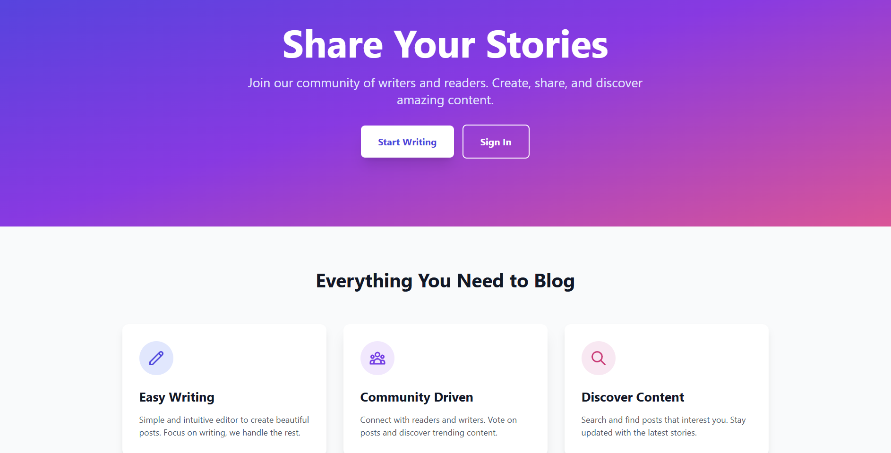
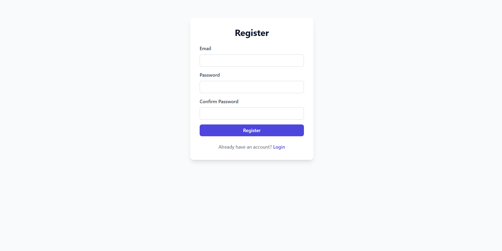
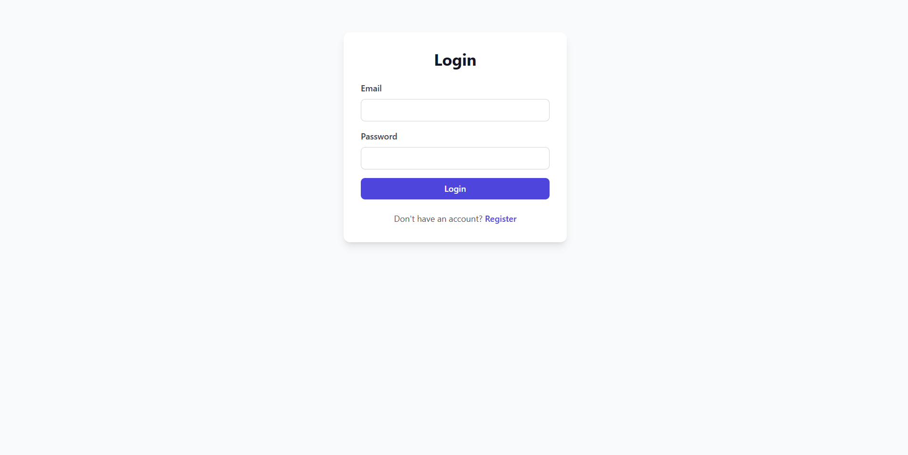
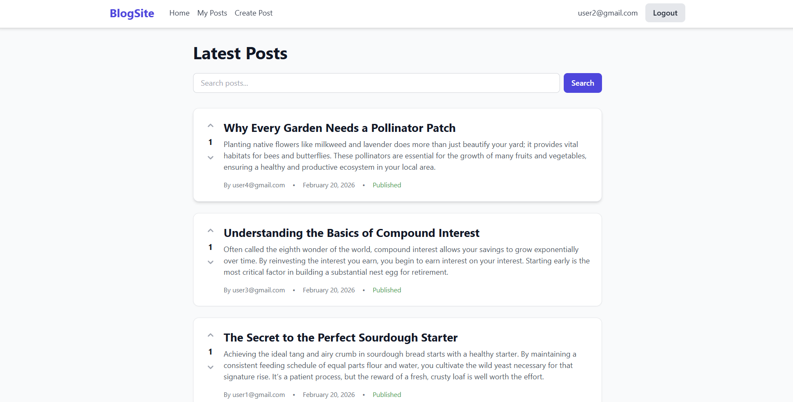
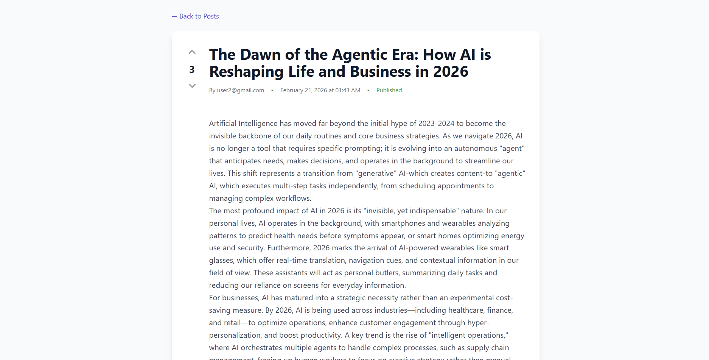
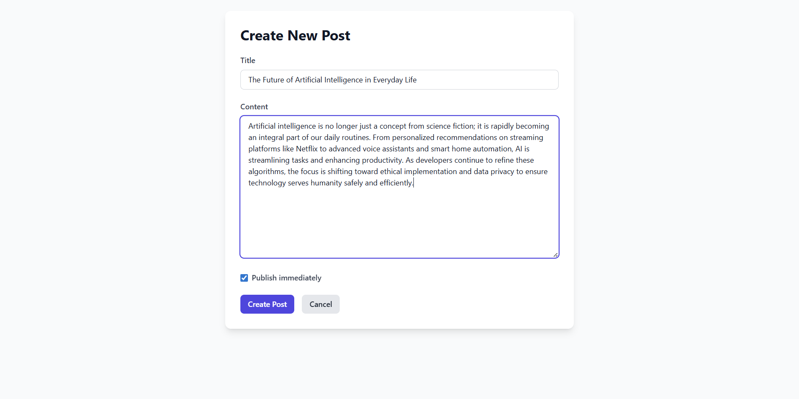
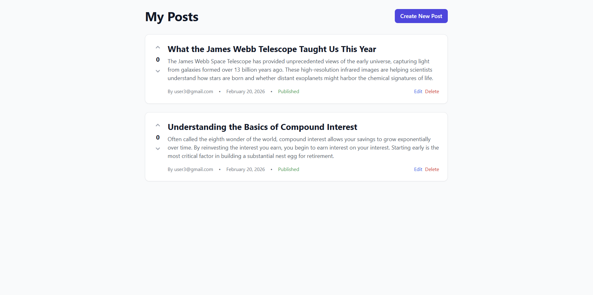
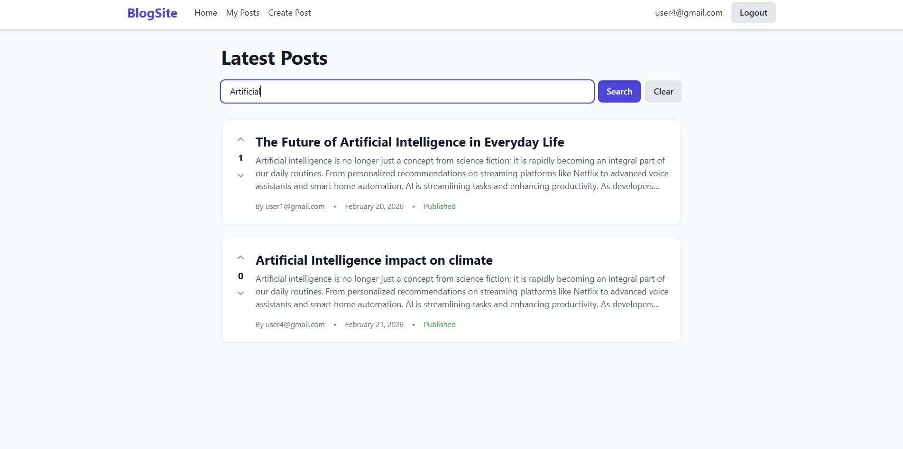

# BlogSite - Full Stack Blog Application

<div align="center">


A modern, full-stack blog application built with FastAPI backend and React frontend.

[Features](#features) • [Demo](#demo) • [Installation](#installation) • [Tech Stack](#tech-stack) • [API Documentation](#api-documentation)

</div>

---

## 📸 Screenshots

### Landing Page


### Authentication




*Secure JWT-based authentication*

### Home Page

*Browse and search through blog posts with voting functionality*

### Post Detail

*Read full posts and interact with voting system*

### Create Post

*Write and publish your own blog posts*

### My Posts Dashboard

*Manage all your posts in one place*

### Search

*Search blog with the title*


---

## ✨ Features

### User Features
- 🔐 **Secure Authentication** - JWT-based login and registration
- ✍️ **Create & Edit Posts** - Write blog posts with draft/publish options
- 👍 **Voting System** - Upvote posts you like
- 🔍 **Search Functionality** - Find posts by title
- 📱 **Responsive Design** - Works on desktop, tablet, and mobile
- 👤 **Personal Dashboard** - View and manage your posts

### Technical Features
- ⚡ **Fast API Backend** - High-performance Python backend
- 🎨 **Modern React Frontend** - Component-based UI with hooks
- 🔒 **Protected Routes** - Secure access control
- 📊 **PostgreSQL Database** - Reliable data storage
- 🔄 **Real-time Updates** - Instant UI updates after actions
- 📝 **Database Migrations** - Alembic for schema management

---

## 🚀 Quick Start

### Prerequisites
- Python 3.8+
- Node.js 16+
- PostgreSQL

### Installation

1. **Clone the repository**
   ```bash
   git clone https://github.com/Hrishikesh-Gaikwad-GG/BlogSite-FastAPI.git
   cd blogsite-fastapi
   ```

2. **Set up the backend**
   ```bash
   # Create virtual environment
   python -m venv venv
   venv\Scripts\activate  # Windows
   # source venv/bin/activate  # Mac/Linux
   
   # Install dependencies
   pip install -r requirements.txt
   
   # Create .env file
   copy .env.example .env
   # Edit .env with your database credentials
   
   # Create database
   createdb -U postgres blogsite
   
   # Run migrations
   alembic upgrade head
   ```

3. **Set up the frontend**
   ```bash
   cd frontend
   npm install
   ```

4. **Run the application**
   ```bash
   # Terminal 1 - Backend
   cd app
   uvicorn main:app --reload
   
   # Terminal 2 - Frontend
   cd frontend
   npm run dev
   ```

5. **Open your browser**
   - Frontend: http://localhost:5173
   - Backend API: http://localhost:8000
   - API Docs: http://localhost:8000/docs

---

## 🛠️ Tech Stack

### Backend
| Technology | Purpose |
|------------|---------|
| **FastAPI** | Modern Python web framework |
| **PostgreSQL** | Relational database |
| **SQLModel** | SQL database ORM |
| **Alembic** | Database migrations |
| **Pydantic** | Data validation |
| **JWT** | Authentication tokens |
| **Passlib** | Password hashing |

### Frontend
| Technology | Purpose |
|------------|---------|
| **React 18** | UI library |
| **Vite** | Build tool & dev server |
| **React Router** | Client-side routing |
| **Axios** | HTTP client |
| **Tailwind CSS** | Utility-first CSS framework |

---

## 📁 Project Structure

```
blogsite-fullstack/
├── app/                      # FastAPI Backend
│   ├── routers/
│   │   ├── auth.py          # Authentication endpoints
│   │   ├── post.py          # Post CRUD operations
│   │   ├── user.py          # User management
│   │   └── vote.py          # Voting system
│   ├── main.py              # FastAPI app entry point
│   ├── models.py            # Database models
│   ├── schemas.py           # Pydantic schemas
│   ├── database.py          # Database connection
│   └── config.py            # Configuration settings
│
├── frontend/                 # React Frontend
│   ├── src/
│   │   ├── components/      # Reusable components
│   │   ├── pages/           # Page components
│   │   ├── services/        # API integration
│   │   └── App.jsx          # Main app component
│   └── package.json
│
├── alembic/                  # Database migrations
├── screenshots/              # Application screenshots
└── README.md
```

---

## 🔌 API Documentation

Once the backend is running, visit:
- **Swagger UI**: http://localhost:8000/docs
- **ReDoc**: http://localhost:8000/redoc

### Main Endpoints

#### Authentication
```
POST   /token              - Login and get JWT token
GET    /users/me           - Get current user info
```

#### Posts
```
GET    /posts/             - List all posts (with search & pagination)
GET    /posts/{id}         - Get single post
GET    /posts/me           - Get current user's posts
POST   /posts/             - Create new post
PATCH  /posts/{id}         - Update post
DELETE /posts/{id}         - Delete post
```

#### Voting
```
POST   /vote/              - Vote on a post (dir: 1 for upvote, 0 to remove)
```

#### Users
```
POST   /users/             - Register new user
GET    /users/{id}         - Get user by ID
```

---

## 💡 Usage

### 1. Register an Account
Navigate to the registration page and create your account with email and password.

### 2. Login
Use your credentials to login. You'll receive a JWT token stored in localStorage.

### 3. Create Posts
Click "Create Post" to write a new blog post. Choose to save as draft or publish immediately.

### 4. Interact with Posts
- **Read** posts by clicking on them
- **Vote** using the up/down arrows
- **Search** for posts using the search bar
- **Edit/Delete** your own posts from "My Posts" page

---

## 🔧 Development

### Backend Development
```bash
# Run with auto-reload
uvicorn main:app --reload

# Create new migration
alembic revision --autogenerate -m "description"

# Apply migrations
alembic upgrade head
```

### Frontend Development
```bash
# Run dev server
npm run dev

# Build for production
npm run build

# Preview production build
npm run preview
```

---

## 🌐 Environment Variables

Create a `.env` file in the root directory:

```env
DATABASE_HOSTNAME=localhost
DATABASE_PORT=5432
DATABASE_PASSWORD=your_password
DATABASE_NAME=blogsite
DATABASE_USERNAME=postgres
SECRET_KEY=your-secret-key-here
ALGORITHM=HS256
ACCESS_TOKEN_EXPIRE_MINUTES=30
```

---

## 👨‍💻 Author

**Hrishikesh Gaikwad**
- GitHub: [Hrishikesh-Gaikwad-GG](https://github.com/Hrishikesh-Gaikwad-GG)

---


<div align="center">

Made with ❤️ using FastAPI and React

⭐ Star this repo if you find it helpful!

</div>
